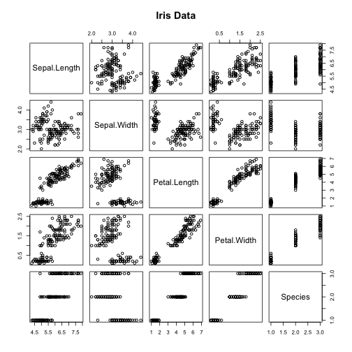

ShinyApp Presentation
========================================================
author: Abhijit Bhiwapure
date: 28-Feb-2016

Purpose of the application
========================================================

This application demonstrates the following:

- Some form of input (widget: textbox,radio button,checkbox,..)
- Some operation on the ui input in sever.R
- Some reactive output displayed as a result of server calculations
- Documentation so that a novice user could use your application.
- The documentation should be at the Shiny website itself. Not an external link.

Note: Please use the HELP tab on the app to know how to use use the app and test these features

Purpose : Explore data in tabular format.
========================================================


```r
library(dplyr)
Tab1 <- iris %>% select(Sepal.Length,Petal.Length) %>% filter(Sepal.Length == 5.1)
head(Tab1)
```

```
  Sepal.Length Petal.Length
1          5.1          1.4
2          5.1          1.4
3          5.1          1.5
4          5.1          1.5
5          5.1          1.7
6          5.1          1.5
```

Purpose: Visualize data by selecting columns.
========================================================

 


How to access Shiny App & Code.
==================================================
The Shiny app: https://logons.shinyapps.io/DataProduct/  

Git repo for ShinyApp: https://github.com/log-ons/DataProduct  

Git Repo for this presentation:   
https://github.com/log-ons/DataProduct/ShinyApp Presentation.Rpres
